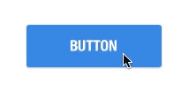
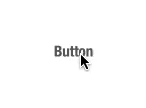
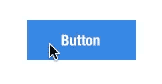
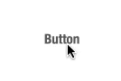
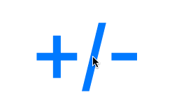
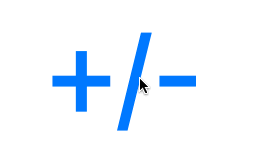

ZFRippleButton
==============

iOS Custom UIButton effect inspired by Google Material Design written in Swift

<p align="center"></p>

## Usage

Set the UIButton class in Nib to ```ZFRippleButton``` or create it programmatically.

### Options
```rippleOverBounds``` indicate that ripple should draw outsise the bounds or not



```trackTouchLocation``` indicate that ripple should show from the touch location or not



```shadowRippleEnable``` indicate that it will show additional shadow when you click or not



and you can set the color of ripple using ```rippleColor``` and ```rippleBackgroundColor```

```touchUpAnimationTime``` is time interval of touch up animation. Default value is 0.6 second and causes slow response to fast consecutive button press as follows:



Shorten this value (the following is 0.1 second) to make the response fast.



## Requirements
- iOS >= 7.0

## Author

Amornchai Kanokpullwad, amornchai.zoon@gmail.com

## License

ZFRippleButton is available under the MIT license. See the LICENSE file for more info.
